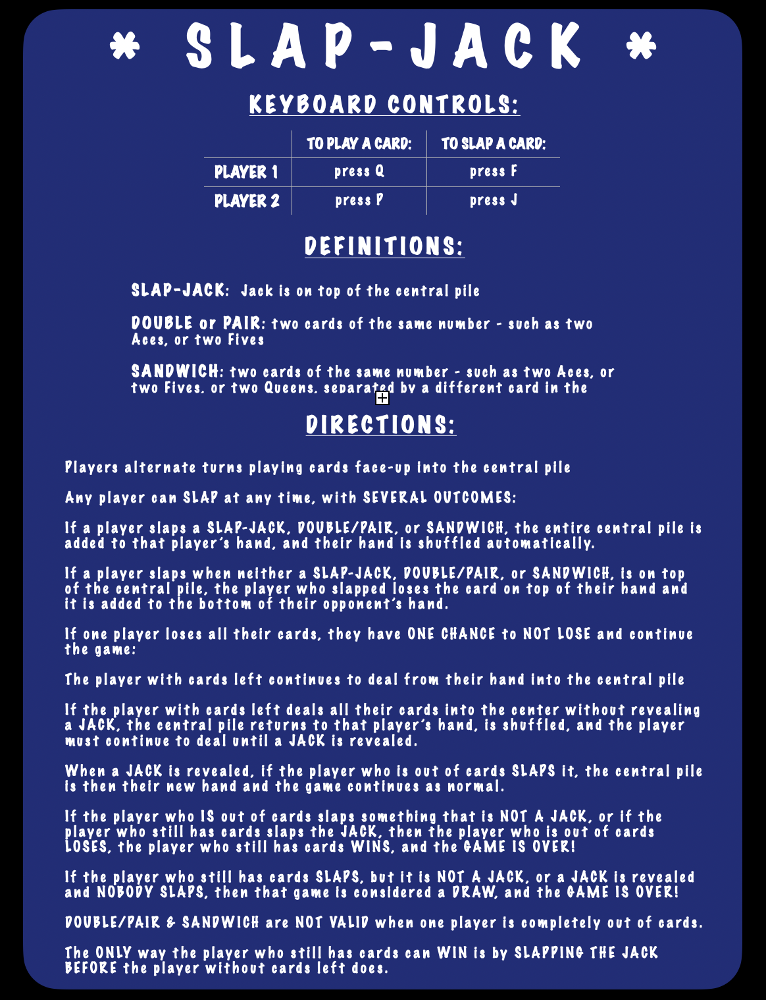

---
<h2 style="text-align:center; font-weight:800; font-size:70px">SLAP-JACK</h2>

  

---

  <h3 style="font-weight:bold">GAME INFORMATION: instructions/rules</h3>

 

---

  

---

  <h4 style="font-weight:bold">AT GAME START (and game info):</h4>

 

---

  

---

  <h4 style="font-weight:bold">NORMAL GAME PLAY:</h4>

 

---

  

---

  <h4 style="font-weight:bold">GAME CONCLUSION: WITH WINNER! </h4>

 

---

  
  <!-- 

 -->

<!--  -->

<!--

# MY repository-template

Directories/file structure for 
  - HTML
  - CSS
  - JavaScript
Templates
  - DTR
  - Pull Request
  - README
  - reflection -->
